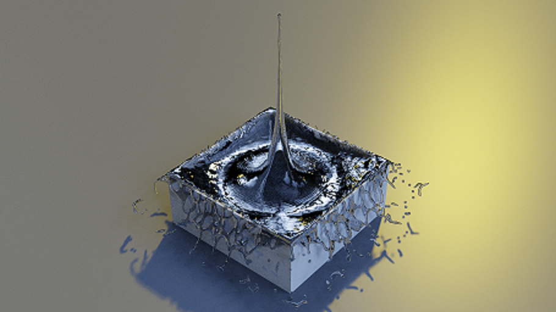

# **VisFluid** 

     

## **About**
VisFluid is a program used to reconstruct fluid surface from particle-based fluid solver and runs fully on NVIDIA GPU. This program bring high-quality visual effects to scientific and engineering simulations, helping people to illustrate their simulation results. This repository provides source code to implement the algorithm presented in the paper [Enhanced narrow band surface reconstruction with anisotropic kernel].  

### **Dependencies**
The code can be compiled on Ubuntu (GCC 6.3.0) with CUDA (>=9.0). To run the executable(s), an NVIDIA GPU should be installed on the machine.  
The dependent vtk8.2 has been given in this repository.  
I notice that if the file is over 25Mb, it cannot be downloaded completely with clone. Before run the code, I recommend downloading the lib/VTK-8.2.0.zip and the test.zip compressed files separately to overwrite incomplete downloads (VTK-8.2.0.zip and test.zip).           

### **Run test**
To run the code, just do:  
> bash run.sh  

The input particle vtk file is located in test/watercrown/particle. Once the program has been executed over, the output triangle meshes ply file will be generated in test/watercrown/surface. This ply file can be opened through Paraview (https://www.paraview.org/) or Blender (https://www.blender.org/). To reproduce the representative figure in the paper, the given blender file can be used, which has already configured the rendering environment and is located in test/watercrown. The only thing need to do is giving the liquid material to the generated ply file.  
Other simulation results can be obtained from partcile-based fluid solver, such as DualSPH (https://dual.sphysics.org/) and GPUSPH (http://www.gpusph.org/).  
If you have any question, contact me 11824048@zju.edu.cn.

